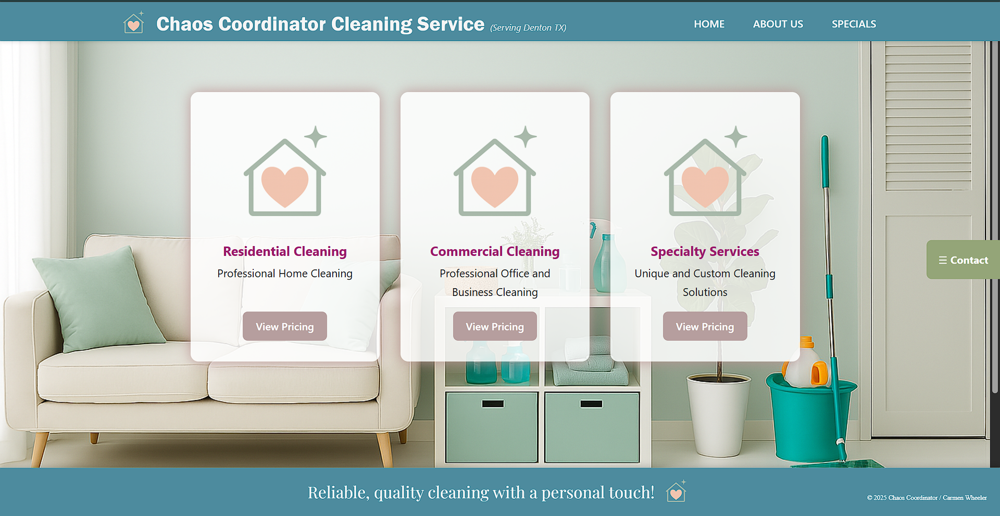

# 🧼 Chaos Coordinator Cleaning Service

> ✨ A clean, modern website for a women-led cleaning business that reflects professionalism, trust, and ease of use — built from scratch by Carmen Wheeler.

---

## 🖥️ Live Demo  
🔗 [https://chaoscoordinator.netlify.app](https://chaoscoordinator.netlify.app)

---

## 📸 Project Overview

Chaos Coordinator Cleaning Service is a Texas-based company dedicated to delivering high-quality residential and commercial cleaning with a personal touch. The goal for this project was to provide the client, **Teri Bugni**, with a professional, client-friendly digital presence that reflects her brand’s warmth, efficiency, and trustworthiness.

This responsive site allows potential clients to:

- Learn about the different types of services offered
- Easily navigate and request pricing
- Contact the business directly via phone, email, or social

---

## 🧰 Built With

| Technology      | Description                              |
|----------------|------------------------------------------|
|  | Frontend JavaScript library |
|  | Fast development/build tool |
|  | Custom styles and layout |
|  | Hosting & continuous deployment |

---

## ✨ Features

- 🔹 Fully responsive design (mobile-first)
- 🔹 Simple, clean layout with clear service offerings
- 🔹 Branded visuals and color palette
- 🔹 Sticky contact widget with direct links to phone, email, and social
- 🔹 Deployed via Netlify for fast and free global hosting

---

## 👩🏽‍💻 About the Developer

**Carmen Wheeler**  
Web Developer & Designer   
🎯 Focus: Clean code, modern design, intuitive UX  
📩 Contact: outsideofemit@gmail.com  
🌐 Portfolio: [cwport.netlify.app](https://cwport.netlify.app/)

I specialize in helping small business owners transform their vision into elegant, easy-to-navigate websites. If you’re ready to bring your brand to life online — I’m open for new projects!

---

## 📸 Screenshots

### Desktop

### Mobile

---

## 📌 Future Enhancements

- [ ] Integrate client testimonial section
- [ ] Add custom request/booking form
- [ ] SEO optimization and analytics tracking
- [ ] Accessibility improvements

---

## 📜 License

This project is licensed under the [MIT License](LICENSE).

---

## 🙌 Acknowledgements

Special thanks to **Teri Bugni** for her vision and trust.  
Her business inspires the same care and detail that this site was built with.

---

## 🔗 Connect With Me

- 💌 outsideofemit@gmail.com  
- 💼 [LinkedIn](https://www.linkedin.com/in/carmendwheeler) 

---

> _“Reliable, quality cleaning with a personal touch — now with a digital home to match.”_
